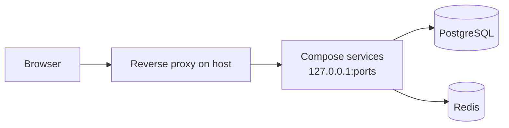

# MTR Web — system context for humans and AI

**This document is the bible for MTR Web:** canonical truth for **architecture, Docker layout, how the repo is built, and how you rebuild/restart**. When anything here conflicts with chat memory, generic Stack Overflow advice, or a model’s defaults — **this file wins.**

**Purpose:** Get assistants **up to speed instantly** without re-explaining the framework each session. It describes **how the project is built and operated**, not individual product features or modules unless needed for **structure** (e.g. which container runs which role).

Read **`§0` first**; use **`§3`** for rebuild decisions and **exact commands** (**§3.5**). If files on disk look incomplete, verify against a **running container** (`docker exec <container> ls /app`) or **backups** — not assumptions from a partial workspace.

---

## 0. Full application overview (read this section first)

### 0.1 What MTR Web is

- **One FastAPI codebase:** `main.py` registers routes; domain logic lives in Python modules alongside it; UI is **`templates/`** + **`static/`**.
- **Many Linux containers, same tree:** Each Compose service builds from the **same** `Dockerfile` with **`COPY . /app`**. Each container runs **Uvicorn** on **`main_<role>:app`**. **`APP_ROLE`** (environment) + **`app_config.py`** decide what that process exposes; routes are **gated by role**.
- **Shared backends:** **PostgreSQL** (via **`db_runtime.py`** / psycopg), **Redis** (cache, pub-sub). Production uses Postgres, not SQLite for this deployment model.
- **Edge routing:** **Nginx (or similar) on the host** terminates TLS and proxies to **`127.0.0.1:<published_port>`** per service (**`§0.4`**).

### 0.2 Request path (every HTTP call)

1. **Browser** → **reverse proxy** on the host → **`127.0.0.1:<published_port>`**.
2. **Container** runs **FastAPI** (`uvicorn main_<role>:app`). **`main.py`** handles routing; **`APP_ROLE`** and middleware gate behavior.
3. Handlers use **PostgreSQL** / **Redis**, **Jinja**, **JSON**.

### 0.3 Architecture diagram



### 0.4 Compose service ↔ role (structural)

Each row is one **Compose service name** (used in `docker compose` and **`scripts/rebuild_services.sh`**). **Authoritative** mappings for the in-app resources dashboard live in **`server_resources.py`** — keep in sync with **`docker-compose.yml`** when the topology changes.

| Compose service | Container (typical) | Published port → app | Uvicorn module |
|-----------------|----------------------|-------------------------|----------------|
| `core` | `mtr-core` | 9002→9000 | `main_core:app` |
| `routers` | `mtr-routers` | 9003→9000 | `main_routers:app` |
| `monitoring` | `mtr-monitoring` | 9004→9000 | `main_monitoring:app` |
| `backhauls` | `mtr-backhauls` | 9005→9000 | `main_backhauls:app` |
| `stock_management` | `mtr-stock-management` | 9006→9000 | `main_stock_management:app` |
| `purchase_orders` | `mtr-purchase-orders` | 9007→9000 | `main_purchase_orders:app` |
| `location_sync` | `mtr-location-sync` | 9008→9000 | `main_location_sync:app` |
| `mtr_live` | `mtr-live` | 9009→9000 | `main_mtr_live:app` |
| `download_test` | `mtr-download-test` | 9010→9000 | `main_download_test:app` |
| `fieldtech` | `mtr-fieldtech` | 9011→9000 | `main_fieldtech:app` |
| `ipam` | `mtr-ipam` | 9012→9000 | `main_ipam:app` |
| `whatsapp_signups` | `mtr-whatsapp-signups` | 9013→9000 | `main_whatsapp_signups:app` |

**Naming:** Usually **`main_<role>.app`** matches Compose service **`<role>`**; exceptions (e.g. **`mtr_live`** ↔ **`main_mtr_live`**) are visible in this table and **`docker-compose.yml`**.

### 0.5 Where important code lives (layout, not features)

| Concern | Primary location |
|---------|------------------|
| HTTP routes, app wiring | `main.py` |
| Per-role startup | `main_<role>.py` (sets **`APP_ROLE`** before importing **`main`**) |
| Role / env | `app_config.py`, **`APP_ROLE`** |
| Auth / RBAC / navigation metadata | `auth_users.py` |
| Database access | `db_runtime.py` → PostgreSQL |
| Compose topology / resources API | `server_resources.py`, `compose_control.py` |
| Automation scripts | `scripts/` |
| HTML | `templates/` |
| Assets | `static/` |

Domain business logic: **`*.py`** modules in the repo root / packages — pair with **`§0.4`** to know which container runs them.

### 0.6 Docker images

| Dockerfile target | Used by | Notes |
|-------------------|---------|--------|
| **`runtime`** | Most app services | App runtime + deps; **no** Docker CLI inside. |
| **`runtime_core`** | **`core`** only | Adds **Docker CLI + Compose plugin** for in-container orchestration. |

Build: **`requirements.txt`** → **`COPY . /app`** → image. **Incomplete tree at build time → broken images** (`ModuleNotFoundError`, crash loops, **502**).

### 0.7 Operator facts (same as runtime behavior)

| Fact | Implication |
|------|-------------|
| **Images contain `/app` from build time** | Editing host files **does not** change running code until **rebuild + recreate** that service’s container. |
| **Compose does not bind-mount the repo over `/app`** by default | Runtime state uses volumes (**data**, **logs**, sockets where applicable). |
| **Some UI state may live in the browser** | Not everything is in Postgres — do not assume “empty DB ⇒ empty UI” for dashboards that cache client-side. |
| **Recovery / deploy contract** | **Compose, files on disk, backups, `docker cp`** — not version control unless the operator chooses it. |

### 0.8 Rules for AI assistants (mandatory)

1. **Treat this file as the bible** for architecture and deploy — not chat memory or generic framework advice.
2. **“Do we need to rebuild?”** → **`§3`** / **`§3.6`**; shell commands → **`§3.5`** only.
3. **Never** suggest **Git** for deploy, recovery, or “getting latest code” unless the **operator explicitly says** they use Git on that host.
4. **Never** answer “I don’t know how your app runs.” Default: **`docker-compose.yml`** in this repo. Caveat **custom** bind-mounts or non-Compose deployments only if the **operator says so**.
5. **502 / import errors after deploy:** suspect **incomplete `COPY . /app` tree** — fix disk contents, **rebuild**; don’t loop on **`restart`** alone.
6. **Don’t assume — know.** Never present guesses as facts. **Verify** by reading this file, searching the repo, reading files, running allowed commands, or checking logs. If something is **not yet verified**, say so plainly and state what would confirm it — do not invent behavior, paths, or deploy steps.

---

## 1. Entrypoint and `APP_ROLE` (detail)

- **`main_<role>.py`** sets `os.environ.setdefault("APP_ROLE", "<role>")` **before** `from main import app`.
- **`app_config.py`** reads **`APP_ROLE`** once at import (default **`core`**).
- **`main.py`** registers routes; **role checks** decide what each container exposes.
- **Templates/static** are **inside each image** — rebuild services that serve changed assets.

---

## 2. Compose pattern

Typical service: **`env_file: .env.compose`**, **`depends_on: postgres, redis`**, **`networks: mtr_net`**, volumes for **data** / **logs**. Host bind address via **`MTR_PUBLISH_HOST`** (often `127.0.0.1`). Topology: **`§0.4`**; source of truth **`docker-compose.yml`**.

Full restore applies **`.env.compose.standby`** on the target with **`MONITORING_SAMPLING_ENABLED=0`**, **`LOCATION_SYNC_SCHEDULER_ENABLED=0`**, and **`CLONE_SCHEDULER_ENABLED=0`** (same stack image as production; only these env layers differ until you promote or edit compose env). **Promote Standby** in the UI runs **`scripts/dr_promote.sh`**, which flips those three back to **`1`**, writes **`data/dr_mode.json`**, and runs **`docker compose … up -d`** so env applies without manual file edits (override with **`DR_PROMOTE_SKIP_COMPOSE=1`** if you must run compose yourself).

### 2.1 Clone or dev without path-based reverse proxy

The UI builds **root-relative** links (`/purchase-orders`, `/mtr-live`, …). **Production** usually puts **one hostname** (TLS) in front of nginx, which maps each path prefix to the correct **`127.0.0.1:<published port>`** (see **`server_resources._COMPOSE_SERVICE_META`**).

If you only open **`http(s)://host:9002/`** (the **core** publish port) on a clone or laptop, those links still go to **port 9002**, so requests hit **core** instead of the module container and return **403 Forbidden** or wrong content — “broken nav”.

**Mitigation:** set **`MTR_NAV_USE_PUBLISHED_PORTS=1`** in **`.env.compose`**. Nav links are then rewritten to **`http(s)://<same Host header>:<service port><path>`**, using the same host ports as **`docker-compose.yml`**. After enabling or disabling this flag, rebuild **all** HTML-serving app services (**`§3.3`**) so every container’s `main.py` matches.

By default, **`core`** also issues a **302 redirect** for **GET** (non-`/api/`) requests when the URL uses a **compose publish port** (9002–9013) that does not own the path — so opening **`http://host:9002/purchase-orders`** jumps to **`http://host:9007/purchase-orders`** without nginx. Disable with **`MTR_NAV_CROSS_SERVICE_REDIRECT=0`** if that interferes with a custom front door.

A **DR standby** that uses the **same path-based reverse proxy** as production should **not** set this flag (nav stays root-relative like production).

---

## 3. Do these changes require rebuilding?

Default model: **`docker-compose.yml`** — no bind-mount of source on **`/app`** unless the operator says otherwise.

### 3.1 Default model

| Fact | Meaning |
|------|---------|
| **`COPY . /app`** | Code and templates live **in the image**. |
| **No source bind-mount on `/app`** | Host edits don’t apply until **rebuild + up**. |
| **`restart`** | Same image only — **not** for new code on disk. |

**Rule:** Changed files baked into the image → **`scripts/rebuild_services.sh <compose-service>`** (or full-stack command in **§3.5**).

### 3.2 Which service to rebuild (pattern-based)

Do **not** memorize feature modules — derive from **layout**:

| What changed | Rebuild |
|--------------|---------|
| **`main_<role>.py`** and Python/templates **owned by that role** (same **`§0.4`** row) | Compose service **`<role>`** from **`§0.4`** (watch naming exceptions in the table / **`docker-compose.yml`**) |
| Files **only** used by **`core`** (e.g. **`compose_control.py`**, **`server_resources.py`**, clone/DR helpers under **`scripts/`** that **core** alone runs — confirm by imports / **`APP_ROLE`**) | **`core`** |
| Shared monolith files (**§3.3**) | **Multiple or all** app services |

When unsure which role owns a file, check **`docker-compose.yml`** (command / **`APP_ROLE`**) and **`main_<role>.py`** imports.

### 3.3 Shared monolith files

Changes to **`main.py`**, **`auth_users.py`**, **`db_runtime.py`**, **`app_config.py`**, shared **`templates/base.html`**, **`static/`**, cross-cutting **`routes/`** / **`notifications/`** → rebuild **all** app services for a consistent fleet, or at minimum every service under test.

### 3.4 In-app operator UI

Embedded **host commands / rebuild** helpers follow the same Compose model (project file, service names, rebuild = new image + recreate).

### 3.5 Exact commands (copy/paste)

Run from the directory containing **`docker-compose.yml`** and **`scripts/`**.

| Goal | Command |
|------|---------|
| **Rebuild one service** | `bash scripts/rebuild_services.sh <compose-service>` |
| **Restart only** (no new code from disk) | `bash scripts/rebuild_services.sh --restart-only <compose-service>` |
| **Rebuild entire stack** | `docker compose -f docker-compose.yml --env-file .env.compose up -d --build` |

Without `.env.compose`, omit **`--env-file .env.compose`**. **`rebuild_services.sh`** auto-detects **`.env.compose`** when present.

```bash
bash scripts/rebuild_services.sh <compose-service>
bash scripts/rebuild_services.sh --restart-only <compose-service>
docker compose -f docker-compose.yml --env-file .env.compose up -d --build
```

Preflight runs unless **`--skip-preflight`** or **`--restart-only`**.

### 3.6 Restart vs rebuild vs env vs proxy (all services)

| Situation | What to do |
|-----------|------------|
| **Changed code or templates** in the image | **Rebuild** affected service(s) — **`bash scripts/rebuild_services.sh <compose-service>`** — **`§3.2`** / **`§3.3`**. **`docker restart`** does **not** load new host files into the image. |
| **Shared monolith files** | Rebuild **multiple or all** — **`§3.3`**. |
| **Only** env vars (e.g. `.env.compose`) — **no** code change | **Recreate** that service (**`docker compose … up -d <service>`**) so env applies. **No image rebuild** unless files on disk changed too. |
| **Host reverse proxy** (routes, TLS, timeouts) | Configure **proxy** and **reload** — not an app-container rebuild. Timeouts shorter than slow requests often yield **504** — fix at proxy or shorten work server-side. |
| **Same image, needs process bounce only** | **`bash scripts/rebuild_services.sh --restart-only <compose-service>`** — **`§3.5`**. |

**Typical one-liner:** **`bash scripts/rebuild_services.sh <compose-service>`** from the repo root that holds **`docker-compose.yml`** and **`scripts/`**.

---

## 4. Safe operational scripts

| Script | Purpose |
|--------|---------|
| **`scripts/rebuild_services.sh`** | Preflight → `build` → `up -d`. Options: `--no-cache`, `--restart-only`, `--skip-preflight`. |
| **`scripts/preflight_docker_context.sh`** | Fail fast if required files missing before build. |
| **`scripts/docker_build.sh`** | Build only (no container recreate). |
| **`scripts/preflight_module_assets.sh <service>`** | Verify templates/static inside running image. |
| **`scripts/safe_restore_assets.sh`** | Restore templates/static safely (**OPERATIONS.md**). |

---

## 5. Before AI recommends any action

1. Identify **layer** (which Compose service / proxy / Postgres / Redis).  
2. **Rebuild / restart / env / proxy:** **`§3.6`**; commands **`§3.5`**.  
3. Confirm **full tree** on disk for **`COPY . /app`** — **`preflight_docker_context.sh`**.  
4. **502 / crash-loop:** **`docker logs <container>`** — incomplete image vs code bug.  
5. **Know, don’t assume** — **`§0.8`** rule **6**: verify in repo/logs/tools before asserting behavior.

---

## 6. Automated tests

No project-wide pytest suite by default. Verification: **`compileall`**, preflight scripts, health endpoints (**OPERATIONS.md**).

---

## 7. Related docs

- **`OPERATIONS.md`** — runbooks (build context, asset restore, clone).  
- **`.cursor/rules/non-negotiables.mdc`** — redundancy, mobile-first, security.

---

*This bible stays authoritative only if it stays aligned with **`docker-compose.yml`**, **`Dockerfile`**, and **`server_resources.py`** when topology or images change.*
